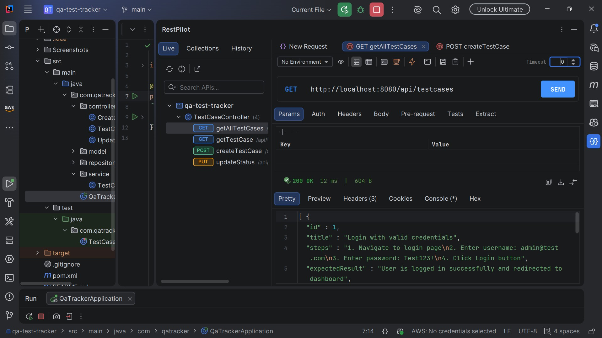
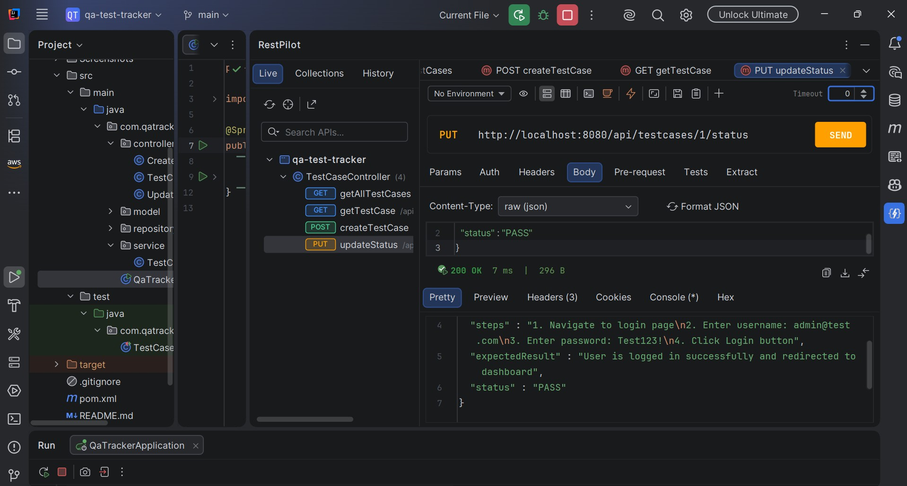

# Sprint 1 Review

## Sprint Goal
Deliver core test case CRUD + status tracking, with a CI pipeline running tests on every push.

## Delivered Stories
| Story | Status | Evidence |
|---|---|---|
| #1 — Create a test case | ✅ Done | See demo below |
| #2 — List all test cases | ✅ Done | See demo below |
| #3 — Update test case status | ✅ Done | See demo below |

## Demo

### 1. Create a test case (Story #1)
**Request:** `POST http://localhost:8080/api/testcases`
```json
{
  "title": "Login with valid credentials",
  "steps": "1. Navigate to login page\n2. Enter username: admin@test.com\n3. Enter password: Test123!\n4. Click Login button",
  "expectedResult": "User is logged in successfully and redirected to dashboard"
}
```
**Expected response:** `201 Created`, body includes generated `id` and `"status": "NOT_RUN"`


### 2. List all test cases (Story #2)
**Request:** `GET http://localhost:8080/api/testcases`
**Expected response:** `200 OK`, JSON array containing the test case(s) created above

[SCREequest and response]

### 3. Update test case status (Story #3)
**Request:** `PUT http://localhost:8080/api/testcases/1/status`
```json
{
  "status": "PASS"
}
```
**Expected response:** `200 OK`, body shows `"status": "PASS"`



## CI/CD Evidence
[SCREENSHOT: GitHub Actions tab showing the CI workflow run with a green checkmark]

## Testing Evidence
[SCREENSHOT: IntelliJ test run panel or terminal output of `mvn test`, showing all 5 tests passing]

## Commit History Evidence


## Stakeholder Feedback
- Positive: core workflow (create → list → mark status) matches how a QA engineer
  actually works day-to-day; the API is simple enough to integrate with a future UI.
- Concern: test cases only exist in memory — a server restart wipes all data.
  Acceptable for this prototype stage, but would need a persistent database
  before any real use.
- Concern: there's currently no way to see *why* a test failed — a failed status
  alone isn't enough for a QA workflow. This is flagged as the next priority
  (addressed in Sprint 2 via defect logging).
- Suggestion: a quick health/summary view would help at a glance without needing
  to call the full list endpoint — also planned for Sprint 2.
